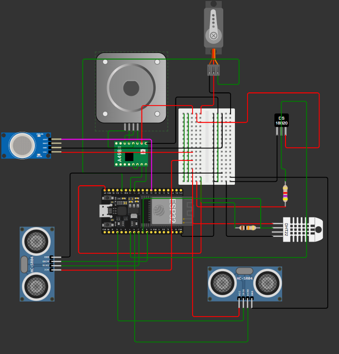

# Fermentation Monitoring System

This project is a **fermentation monitoring system** built using an **ESP32 DevKitC V4** in a **Wokwi simulation**. It integrates multiple sensors and actuators to monitor the fermentation environment and respond automatically to certain conditions.  
WOKWI_HOST = "http://localhost:8180"  # ESP WebServer
---

## Features

- **Temperature Monitoring:** Using DS18B20 sensor; triggers stepper motor if temperature exceeds 100°C.  
- **Humidity Monitoring:** Using DHT22 sensor (readings available for display/logging).  
- **Distance Monitoring:** Two HC-SR04 ultrasonic sensors; triggers servo motor when object is detected within 20 cm.  
- **Gas Detection:** MQ gas sensor detects fermentation gases and prints status to serial.  
- **Actuator Control:**  
  - Stepper motor (via A4988 driver) for high-temperature response.  
  - Servo motor rotates based on proximity sensor input.  

---

## Components

| Component | Description | ID |
|-----------|-------------|----|
| ESP32 DevKitC V4 | Main microcontroller | esp |
| Breadboard Mini | Prototyping board | bb1 |
| A4988 Stepper Motor Driver | Drives stepper motor | drv1 |
| Stepper Motor (Size 17) | Rotates when temperature > 100°C | stepper1 |
| Servo Motor | Rotates on ultrasonic trigger | servo1 |
| DS18B20 Temperature Sensor | Measures temperature | temp1 |
| Resistor 4.7kΩ | Pull-up for DS18B20 | r1 |
| DHT22 Sensor | Measures temp & humidity | dht1 |
| Resistor 10kΩ | Pull-up for DHT22 | r2 |
| HC-SR04 Ultrasonic Sensor 1 | Measures distance for servo trigger | ultrasonic1 |
| HC-SR04 Ultrasonic Sensor 2 | Measures distance; prints to serial | ultrasonic2 |
| MQ Gas Sensor | Detects fermentation gases | gas1 |

---

## Pin Connections

| Sensor/Actuator | ESP32 Pin |
|-----------------|-----------|
| DS18B20         | 4         |
| DHT22           | 5         |
| Servo Motor     | 13 (PWM)  |
| Stepper STEP    | 12        |
| Stepper DIR     | 14        |
| Ultrasonic 1 TRIG | 15      |
| Ultrasonic 1 ECHO | 16      |
| Ultrasonic 2 TRIG | 17      |
| Ultrasonic 2 ECHO | 18      |
| Gas Sensor Analog Out | 33  |

> Refer to `diagram.json` for the complete wiring details.

---

## Code

The Arduino code periodically reads all sensors, controls actuators based on thresholds, and prints status to the serial monitor.  

**Dependencies:**

- `OneWire.h`  
- `DallasTemperature.h`  
- `DHT.h`  
- `ESP32Servo.h`  

---

## Setup Instructions

1. Open the project in **Wokwi**.  
2. Connect components as per the wiring diagram.  
3. Upload the provided Arduino code to the ESP32.  
4. Run the simulation and observe the behavior via serial monitor.  

---

## How It Works

1. **Temperature Control:** Stepper motor rotates if DS18B20 detects >100°C.  
2. **Proximity Control:** Servo motor rotates if ultrasonic sensor detects <20 cm.  
3. **Gas Detection:** MQ sensor prints `"fermentation ongoing"` if gas levels are high, otherwise `"fermentation off"`.  
4. **Data Monitoring:** All sensor readings are printed to the serial monitor for real-time tracking.  

---

## License

This project is open-source and available under the MIT License.  

---

## Author

[Al Nahian Mugdho]
[Ultra-X BD]
